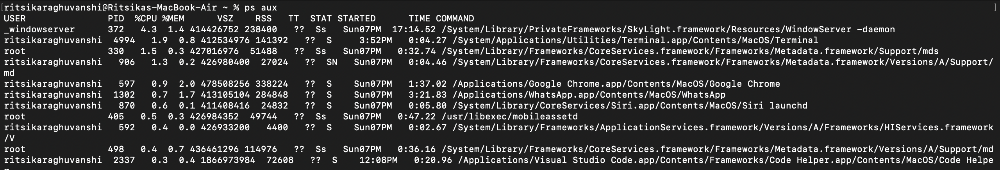
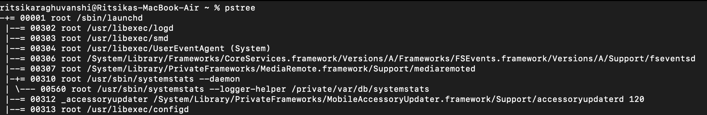
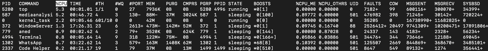
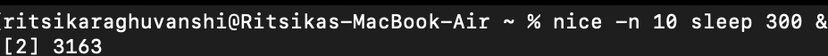
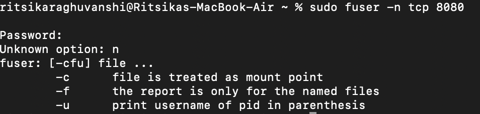
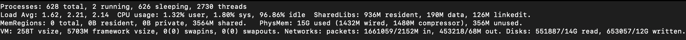
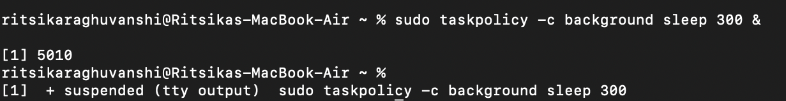

# 🧠 Linux Process Management – Assignment

> 💡 **Objective:** Understand how to monitor, control, and optimize processes in a Linux system using essential process management commands.

---

## 🔹 1. Viewing All Processes

**🖥️ Command:**
```bash
ps aux
```

**📘 Explanation:**
- `a` → Show processes for **all users**  
- `u` → Display the **user/owner** of each process  
- `x` → Show processes **not attached to a terminal**

**📊 Example Output:**
---

## 🌲 2. Process Tree

**🧩 Command:**
```bash
pstree -p
```

**📊 Example Output:**


> 🪴 **Description:** Displays parent-child relationships between processes in a tree format.

---

## 📈 3. Real-Time Process Monitoring

**⚙️ Command:**
```bash
top
```

**📊 Example Output:**


> 🧭 Press **`q`** to quit the `top` interface.

---

## ⚡ 4. Adjusting Process Priority

**🟢 Start Process with Low Priority:**
```bash
nice -n 10 sleep 300 &
```

**Output:**
```
[1] 3050
```

> 🎯 PID `3050` runs in the background with a **nice value of 10** (lower priority).

**🔧 Change Priority of a Running Process:**
```bash
renice -n -5 -p 3050
```

**Output:**
```
3050 (process ID) old priority 10, new priority -5
```


> 🚀 Higher priority (negative nice value = more CPU time).

---

## 🧠 5. CPU Affinity (Bind Process to CPU Core)

**Check Current Affinity:**
```bash
taskset -cp 3050
```
**Output:**
```
pid 3050's current affinity list: 0-3
```

**Restrict to Core 1 Only:**
```bash
taskset -cp 1 3050
```
**Output:**
```
pid 3050's current affinity list: 1
```


> ⚙️ Useful for assigning specific processes to specific CPU cores.

---

## 💾 6. I/O Scheduling Priority

**Command:**
```bash
ionice -c 3 -p 3050
```

**Output:**
```
successfully set pid 3050's IO scheduling class to idle
```

> ⚡ Class **3 (idle)** means process only performs I/O when the system is idle.

---

## 📑 7. File Descriptors Used by a Process

**Command:**
```bash
lsof -p 3050 | head -5
```

**Example Output:**
```
COMMAND  PID USER   FD   TYPE DEVICE SIZE/OFF   NODE NAME
sleep   3050 ritsikaraghuvanshi  cwd  DIR  253,0     4096  131073 /desktop/projects
sleep   3050 ritsikaraghuvanshi  rtd  DIR  253,0     4096       2 /
sleep   3050 ritsikaraghuvanshi  txt  REG  253,0    17520  133580 /usr/bin/sleep
```

> 🔍 Lists all files, directories, and devices opened by a specific process.

---

## 🐛 8. Trace System Calls of a Process

**Command:**
```bash
strace -p 3050
```

**Example Output:**


> 🧩 Great for **debugging** system calls and understanding process behavior.

---

## 📡 9. Find Process Using a Specific Port

**Command:**
```bash
sudo fuser -n tcp 8080
```

**Example Output:**
```
8080/tcp:           4321
```



> 🔎 PID **4321** is using port **8080**.

---

## 📊 10. Per-Process Statistics

**Command:**
```bash
pidstat -p 3050 2 3
```

**Example Output:**


> 📈 Monitors CPU usage of a process at fixed intervals.

---

## 🔐 11. Control Groups (cgroups) for Resource Limits

**Create a New cgroup:**
```bash
sudo cgcreate -g cpu,memory:/testgroup
```

**Limit CPU and Memory:**
```bash
echo 50000 | sudo tee /sys/fs/cgroup/cpu/testgroup/cpu.cfs_quota_us
echo 100M   | sudo tee /sys/fs/cgroup/memory/testgroup/memory.limit_in_bytes
```

**Add Process (PID 3050) to cgroup:**
```bash
echo 3050 | sudo tee /sys/fs/cgroup/cpu/testgroup/cgroup.procs
```

> 🧩 Helps allocate specific CPU or memory resources to defined groups of processes.

---

## 🎯 12. Alternatives to `nice` / `renice`

| Tool | Focus | Example Command | Description |
|------|--------|-----------------|--------------|
| **chrt** | Real-time scheduling | `sudo chrt -f 50 sleep 1000` | FIFO or RR scheduling policies |
| **ionice** | I/O priority control | `ionice -c 2 -n 7 tar -czf backup.tar.gz /home` | Manages I/O bandwidth |
| **taskset** | CPU affinity | `taskset -c 1 firefox` | Bind to specific CPU cores |
| **cgroups** | Resource management | `sudo cgcreate -g cpu,memory:/lowprio` | Fine-grained control of CPU/memory |
| **systemd-run** | Scoped execution | `systemd-run --scope -p CPUWeight=200 stress --cpu 4` | Uses systemd + cgroups |
| **schedtool** | Custom scheduling | `sudo schedtool -R -p 10 <pid>` | Sets custom scheduling class |

---

## ✅ Summary

| Category | Command | Description |
|-----------|----------|-------------|
| 🧭 Process Listing | `ps`, `pstree`, `top` | View system processes |
| ⚙️ Priority Control | `nice`, `renice`, `chrt` | Manage process CPU priority |
| 🧠 CPU Affinity | `taskset` | Bind processes to cores |
| 💾 I/O Management | `ionice` | Control disk I/O scheduling |
| 📂 Resource Limits | `cgroups`, `systemd-run` | Restrict CPU/memory usage |
| 🪄 Debugging | `strace`, `lsof`, `pidstat` | Analyze process behavior |

---