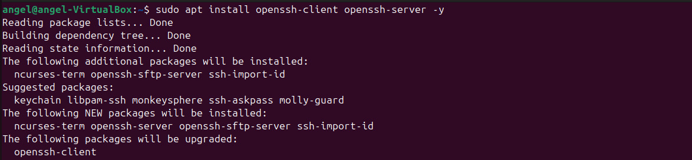
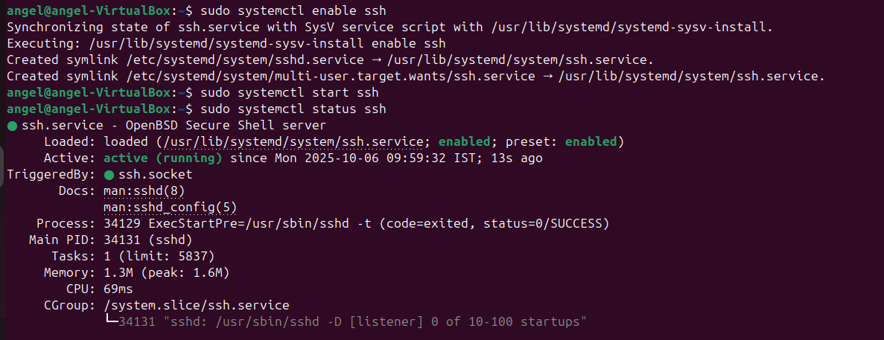
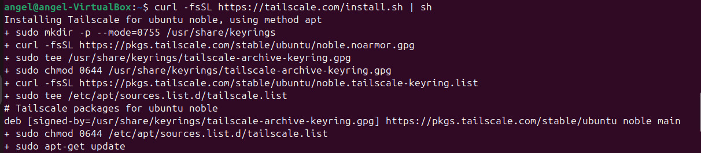

🔧 Technical Document

# Sharing Files Between Two Laptops on the Same Network Using SSH

# Introduction

File transfer between computers is a fundamental task in networking. While basic methods like USB drives or open network shares exist, these can be inefficient, insecure, or cumbersome—especially over modern networks. Secure Shell (SSH) offers a robust way to move files with strong encryption and authentication, protecting sensitive data from unauthorized access or interception during transit.​

This document explains not only how to use SSH to transfer files between desktops, but also why this approach is preferred, the reasoning behind each step, and the security benefits offered by SSH-based file transfer.

## *Question- Why Use SSH for File Transfer?*

*Security*: SSH encrypts data end-to-end, preventing others on the network from eavesdropping or tampering with files in transit.​

*Authentication*: SSH requires user credentials (often a password or cryptographic key), ensuring only authorized users can access the target machine.​

*Convenience & Compatibility*: Most modern operating systems natively support SSH and related tools, making them widely available for seamless integration.​

*Reliability*: SSH has built-in integrity checks, so transferred data arrives uncorrupted even if the connection is unreliable.​

## \>Scenario

You need to transfer a file from your desktop to another computer on the same network. Instead of using insecure methods, SSH provides a quick, secure, fully authenticated way to send files using the network infrastructure already in place.

### 🧩 Objective

To securely share files between two laptops connected to the *same local network* using *SSH (Secure Shell)* and *SCP (Secure Copy Protocol)*.

## 🖥️ 1. Prerequisites

Before starting, ensure the following:

1.  *Both laptops are on the same Wi-Fi or LAN network.*
    
2.  *SSH is installed and enabled* on both systems.
    
3.  You know the *username* and *IP address* of the target laptop.
    

## 🔑 2. Step 1 – Install & Enable SSH

#### Why:

To receive files via SSH, the destination machine must have an SSH server running. This ensures it listens for incoming connections and can securely handle file transfer requests.

#### How?

⁠ ```bash
sudo apt install ssh
 ```⁠

This command installs the OpenSSH server package on Linux-based systems.


## 🔑 3. Step 2 - Enable and Start the SSH Service

#### Why:

Starting the SSH service brings the SSH server online immediately, while enabling it ensures it will automatically start whenever the system boots—important for ongoing usability and remote access.

#### How?

```bash
sudo systemctl start ssh
sudo systemctl enable ssh
```
 ⁠

Enabling and starting the service now ensures you won’t have to repeat setup after a restart.


## 🔑 4. Step 3 - Verify SSH is Running

#### Why:

Checking status ensures SSH is active and ready to accept connections. This step helps find misconfigurations or errors before attempting a real file transfer.

#### How?

⁠ ```bash
sudo systemctl status ssh
A successful status means incoming connections are possible.
 ⁠```


## 🔑5. Step 4 - Obtain the Username and IP Address of the Target Machine

#### Why:

SSH connections require the username for authentication and the IP address to identify the network endpoint. Without these, you cannot establish a session.

#### How?

```bash
whoami
hostname -I
```

whoami shows the current user’s login name; hostname -I displays the network IP address used for the transfer.
 ⁠

## 🔑6. Step 5 - Initiate SSH Connection from the Source Machine

#### Why:

Testing SSH access ensures credential validity and network reachability before transferring files. This confirms you can connect and have the necessary permissions.

### How?

```bash 
ssh username@ipaddress
```

Replace username and ipaddress with the actual values gathered earlier.

## 🔑7. Step 6 - Securely Transfer the File Using SCP

### Why:

With SSH verified, Secure Copy Protocol (SCP, part of SSH) encrypts the file during transmission, protecting contents from snooping or corruption.​

#### How?

```⁠bash
scp /path/to/local/file username@ipaddress:/path/to/target/directory
```
 ⁠

This command copies a file securely to the target machine; use -r for directories.

## 🔑8. Step 7 - Verify Success on the Target Machine

#### Why:

Confirming the presence and integrity of the transferred file ensures the process is complete and no errors occurred during transit.

#### How?

Check the specified directory on the target computer for the file.

***Additional Security and Troubleshooting  
Firewall Considerations***:  
Ensure port 22 (SSH's default) is open on both computers so connections are allowed.​

**Password vs. Keys**:For repeated transfers, SSH keys can streamline authentication while maintaining high security.


## 🔑Conclusion

Transferring files over SSH is a best practice for local networks because it fuses security, convenience, and reliability. Setting up SSH once means continued, easy file transfer in the future, keeping your files protected with strong encryption and access controls.


⁠* *


# Secure File Sharing Between Devices Using Tailscale, curl, and SSH

# Introduction

Transferring files between devices on different networks can be complex due to firewalls, NAT, and permissions. Tailscale overcomes these hurdles by creating a personal, encrypted mesh network ("tailnet") where all your devices are instantly reachable by private IP, regardless of location. This workflow uses Tailscale for network setup, SSH for secure command-line file transfer, and curl for command-line download/upload use cases.

*This guide explains both the how and why for each major command in the process.*

*Why Use Tailscale, SSH, and curl?*  
**Tailscale:** Instantly creates a secure VPN across all your devices—accessible anywhere, with zero configuration required for firewalls or ports.​

**SSH:** Provides encrypted, authenticated remote access for secure file transfers; bypasses risks of unprotected protocols.​

**curl:** Enables HTTP/S command-line downloads/uploads, great for scripting, automating, or working with web APIs in secure tunnels.

# Step-by-Step Process & Command Explanations

## 🔑 Step 1 - Install & Authenticate Tailscale on Both Devices

#### Why:

Tailscale treats each device as part of your secure network, assigns a unique internal IP, and manages all connections via WireGuard encryption—making file transfer as simple as LAN even over the internet.​

#### How (Linux example):

```bash 
curl -fsSL https://tailscale.com/install.sh | sh
```

Downloads and installs Tailscale securely using curl.


```bash
sudo tailscale up
```
Authenticates the device with your account, brings it online in your tailnet, and establishes encrypted connectivity.

## 🔑Step 2 - Enable Tailscale SSH (For Secure Shell Sessions & SCP)

#### Why:

Tailscale SSH bypasses tedious manual SSH key management, automatically updates keys, and enforces access controls according to your ACL policy.​

#### How:

```bash 
sudo tailscale up --ssh
```


Enables Tailscale SSH, allowing you to SSH into this device from any other authenticated device within your tailnet with a single, internal IP.

## 🔑 Step 3 - Find the Tailscale Internal IP Address

#### Why:

Tailscale assigns each device an IP in the 100.x.y.z range for private communication, avoiding conflicts and exposing nothing to the public internet.

#### How:

```bash
tailscale ip
```

Returns the device's internal Tailscale IP (e.g., 100.95.96.66).

## 🔑 Step 4 - Connect via SSH for File Transfer (scp, sftp, rsync)

#### Why:

SSH and SCP allow secure, authenticated file transfer between your devices, traversing firewalls & NAT using Tailscale’s mesh VPN. Tailscale manages authentication, rotates keys, and logs sessions for compliance.​

#### How:

```bash
ssh username@100.95.96.66
```
 ⁠

or, for file transfer:

```bash
scp localfile username@100.95.96.66:/target/directory/
```

Replace username and 100.95.96.66 with actual values from previous steps.

## 🔑 Step 5 - Use curl for Secure HTTP/S Transfers Via Tailscale Network

#### Why:

Sometimes, you may want to download a file from a local service or API exposed via Tailscale (using tailscale funnel or tailscale serve). This ensures your HTTP traffic is routed securely through your tailnet and leverages HTTP authentication and encryption.

#### How:

```bash
curl http://100.95.96.66:8080/file.zip -o file.zip
```

Downloads the file from a web service running on your Tailscale node, using its internal IP for secure transfer.

## 🔑 Step 6 - (Optional) Use Tailscale Funnel to Expose File Services

#### Why:

tailscale funnel allows you to expose a local file server, API, or TCP service over your tailnet (or even the public internet in a controlled, secure way).

#### How:

```bash
tailscale funnel --tcp 10000 tcp://localhost:8080
```

Exposes a TCP service (e.g., HTTP, SSH, etc.) through your Tailscale mesh VPN at a standard port, restricting access to authenticated users.

*Security and Access Controls*  
Only authenticated users & devices in your tailnet can connect or transfer files.  
Tailscale manages keys and session recording for secure SSH—no manual config needed.  
All transfers (SSH, SCP, SFTP, curl) are encrypted with WireGuard, providing protection against eavesdropping.

&nbsp;